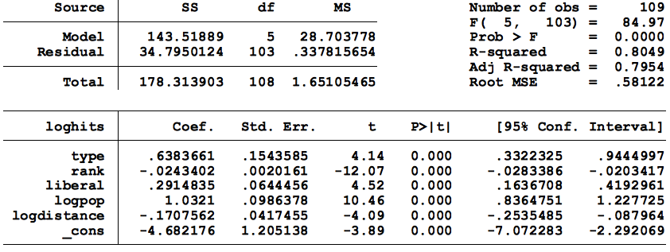
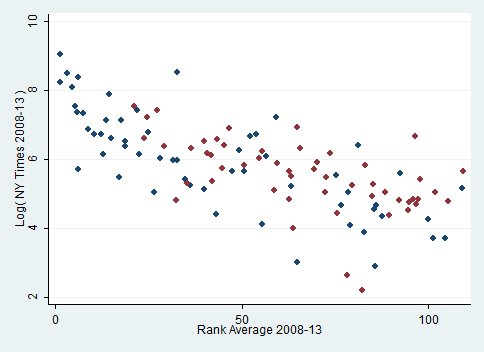
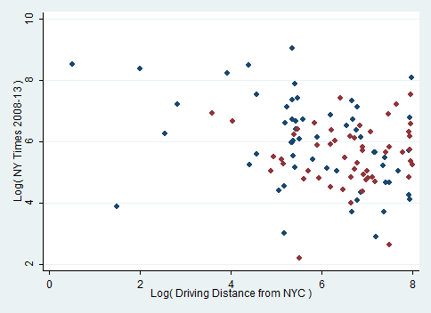
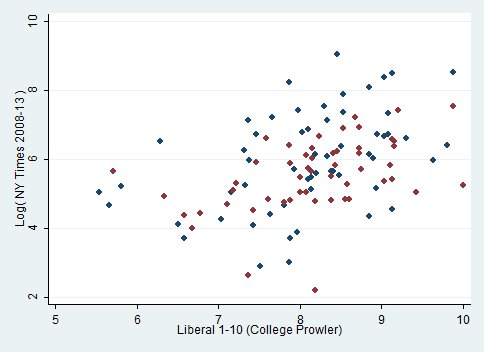
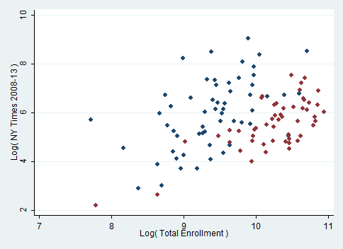

## NY Times Coverage Research
[http://publiceditor.blogs.nytimes.com/2014/08/27/a-teenagers-study-suggests-public-colleges-get-less-times-attention/](http://publiceditor.blogs.nytimes.com/2014/08/27/a-teenagers-study-suggests-public-colleges-get-less-times-attention/)

### Intro
Analyzing how universities are covered in the New York Times relative to each other is difficult due to genuine differences in quality and newsworthiness, but the [U.S. News college rankings](http://colleges.usnews.rankingsandreviews.com/best-colleges/rankings/national-universities/data) can be used to account for these differences. When analyzed in conjunction with several other metrics including size, proximity to New York and political reputation, it can be shown that public schools are overall covered less than equivalent private schools.

### Methodology
Using U.S. News rankings from 2008-13, we found which schools appeared in the top 100 within those years and each school’s average ranking. We then found the number of New York Times articles referencing each school in the same period. Sports, weddings and obituaries were not included. For private schools with ambiguous names, such as Columbia, these numbers are underestimations (ie, only include articles explicitly naming “Columbia University” or using the phrase “at Columbia”). For public schools in systems with multiple campuses, specific references to extraneous campuses are removed, but ambiguous references to the system are kept, and so these are overestimations. We then compiled the radius and driving distance from Manhattan to each school with Googles Maps’ API, [College Prowler’s](http://colleges.niche.com) crowd sourced liberalness rating, student populations from U.S. News, religious affiliation, presence of a journalism program and whether the institution was public or private from university websites, and records of both direct funding from the National Science Foundation and total R&D spending from the National Science Foundation. We then tested how these factors are correlated with Times coverage via multiple regression.

There are some obvious limitations, including not knowing whether an article included simply a mention or if it was actually about the campus. Still, articles mentioning, for example, researchers from a school and articles about specific schools both represent the same propensity to go to certain places for expertise or news.

### Results
Religious affiliation, journalism programs, NSF funding and research spending were not statistically significant. Average ranking, driving distance, liberalness and size were statistically significant, with driving distance a slightly more accurate predictor than radius. Overall, the Times covers schools that are highly ranked, larger, more liberal, and closer to New York, more. Public schools are not covered as much as private schools, accounting for those factors.

#### In the graphs below, private schools are blue and public schools are red:

### Residuals
The table below shows which schools are covered more or less than expected given their objective metrics. (Public/private not included in this regression)

Higher Coverage         |Lower Coverage
------------------------|-------------------------------------
Harvard	              |WPI
Stony Brook University  |SUNY ESF
Stanford                |Clemson
University of Arizona   |Stevens Institute of Technology
Fordham                 |Purdue
American University     |William & Mary
University of San Diego |Colorado School of Mines
Yale                    |RPI
Howard University       |University of Florida
Vanderbilt              |UC Santa Barbara
Southern Methodist      |Georgia Tech
CalTech                 |UNC Chapel Hill
Georgetown              |University of Georgia
Notre Dame              |Washington University in St. Louis

[This data is mirrored and can be queried via API here](https://www.exversion.com/data/view/07B3UJ5AN2JJ52S) - Thanks mbellotti

